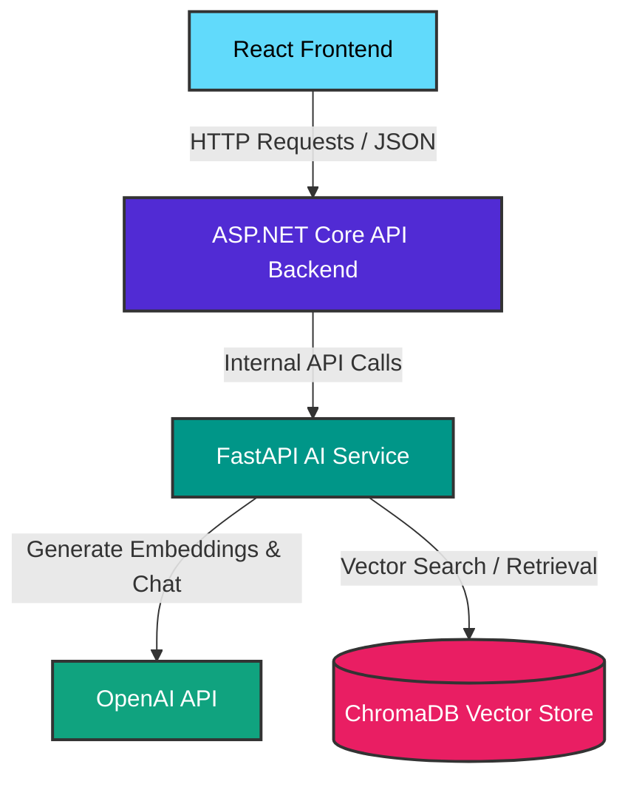

# AI Customer Support System

An AI-powered customer support platform built with ASP.NET Core, React, FastAPI, OpenAI Embeddings, ChromaDB, and Retrieval-Augmented Generation (RAG).

### 🏗️ System Architecture

## Features

* JWT Authentication
* Conversation Management
* Chat History
* AI-powered Customer Support
* Vector Database (ChromaDB)
* Semantic Search
* Retrieval-Augmented Generation (RAG)
* React CRM Dashboard
* ASP.NET Core REST API
* FastAPI AI Service

## Tech Stack

### Backend

* ASP.NET Core 8
* Entity Framework Core
* SQL Server
* JWT Authentication

### Frontend

* React
* TypeScript
* TailwindCSS
* Axios

### AI

* FastAPI
* OpenAI API
* Embeddings
* ChromaDB
* RAG

## Architecture

React Frontend
↓
ASP.NET Core API
↓
FastAPI AI Service
↓
OpenAI Embeddings
↓
ChromaDB Vector Database

## Future Improvements

* Knowledge Base Management
* Ticket Classification using Machine Learning
* Analytics Dashboard
* Docker Deployment
* CI/CD Pipeline

