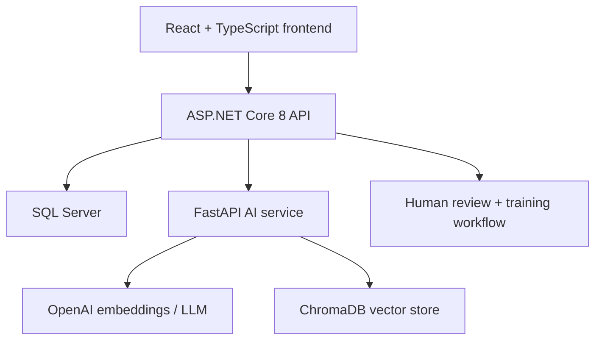
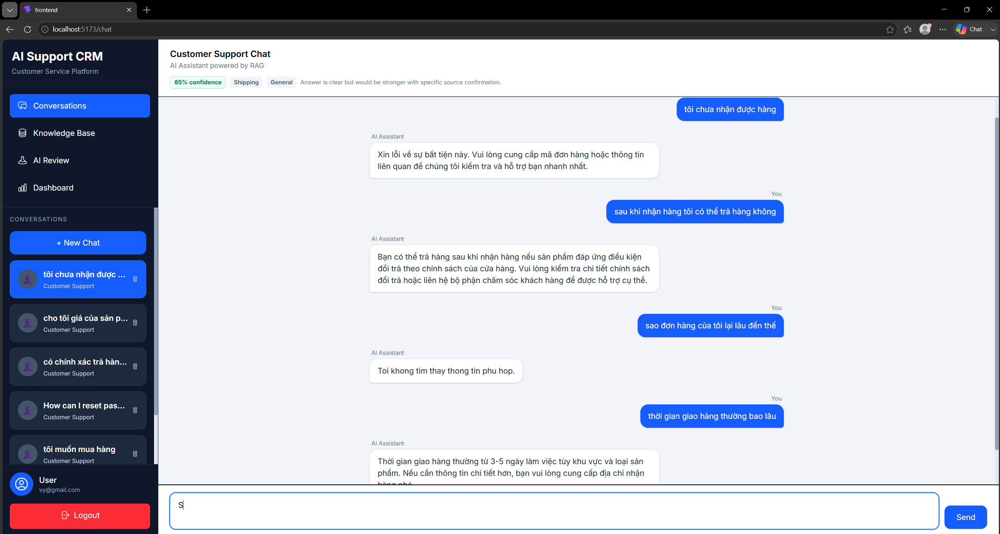
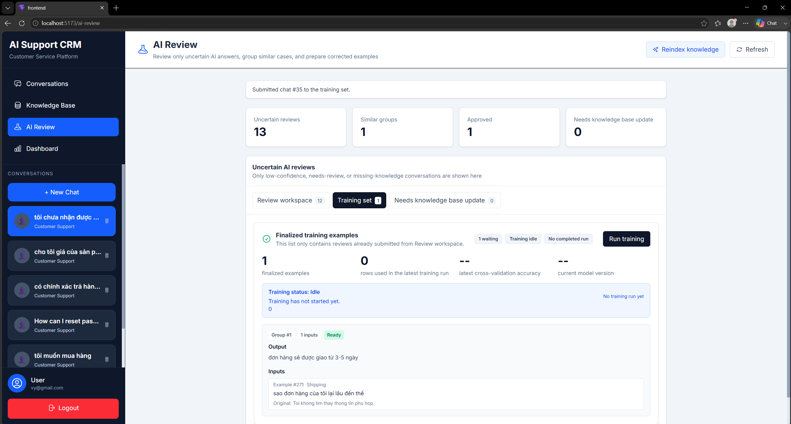
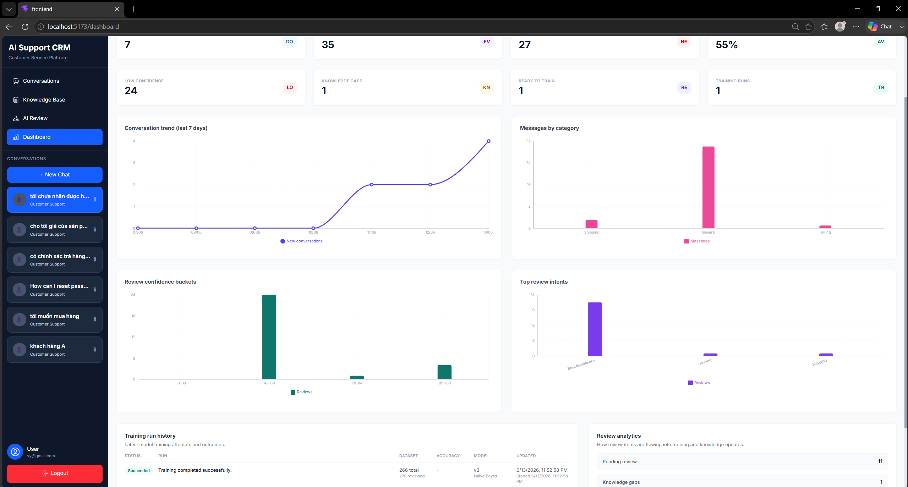
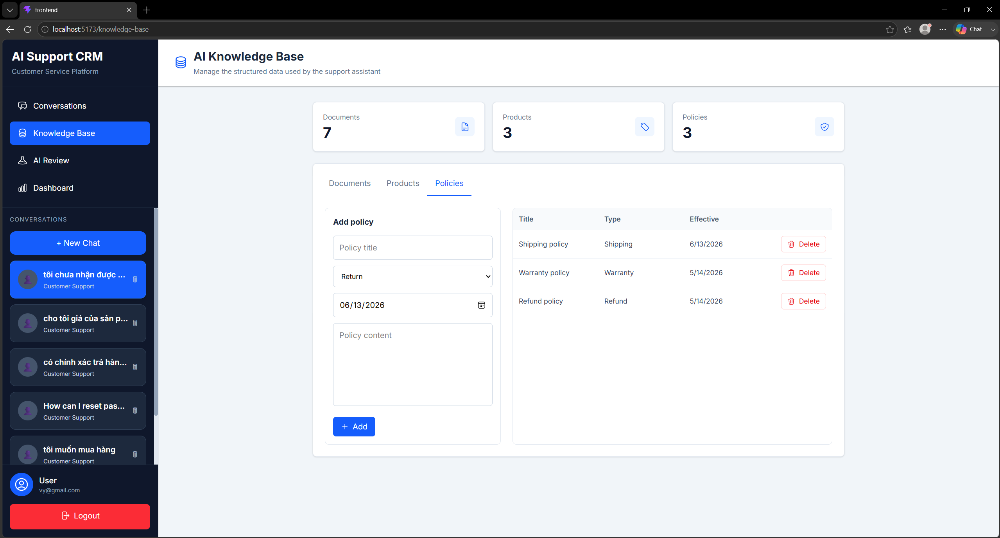

# AI Customer Support Platform

An end-to-end customer support system that combines a modern web app, a .NET API, and a Python AI service to deliver retrieval-augmented answers, review low-confidence conversations, improve the knowledge base, and continuously retrain the classifier from human feedback.

This repository is a portfolio project intended to demonstrate practical full-stack engineering and AI product thinking, not just isolated model experiments.

## At a glance

- Built a full-stack AI support platform with ASP.NET Core, React, FastAPI, SQL Server, and ChromaDB
- Added a human-in-the-loop review workflow for low-confidence answers and knowledge gaps
- Converted reviewed feedback into structured training data and retraining runs
- Implemented dashboards for review operations, confidence analysis, and training history

## Portfolio summary

This project demonstrates how an AI support assistant can be operated as a product, not just a model demo. Instead of stopping at chatbot responses, the system captures low-confidence answers, routes them into a review workspace, groups similar failures, allows operators to correct them once, promotes approved feedback into a training set, and turns unresolved cases into structured knowledge base updates. The result is a practical learning loop that improves both retrieval quality and classification performance over time.

## What this project does

- Authenticated customer support workspace with conversation history
- AI-powered chat backed by RAG over documents, products, and support policies
- Automated answer evaluation after each assistant response
- Review workspace for low-confidence or missing-knowledge cases
- Similar-review grouping to reduce repetitive human corrections
- Knowledge-gap workflow that turns weak answers into structured knowledge base updates
- Training set workflow that promotes approved feedback into model retraining
- Training run history and review analytics dashboard

## Why this project is interesting

Most demo chatbots stop at "ask question, get answer." This project goes further by implementing an operational feedback loop:

1. A user sends a message.
2. The AI service classifies the request and answers with RAG.
3. The answer is automatically evaluated for confidence, intent, category, and knowledge gaps.
4. Low-confidence reviews are grouped for faster human correction.
5. Approved corrections become training examples.
6. Missing knowledge is converted into structured knowledge base entries.
7. The model can be retrained from reviewed examples, and each run is tracked in the dashboard.

That makes the system much closer to a real support AI workflow than a simple chatbot sample.

## Core features

### Customer support experience

- JWT-based authentication
- Conversation list and message history
- Real-time chat with AI-generated support answers
- Automatic conversation title updates

### Knowledge base management

- Separate CRUD management for:
  - Documents
  - Products
  - Support policies
- Vector indexing for all knowledge sources
- Reindex endpoint for rebuilding retrieval data when needed

### AI review and feedback loop

- Automatic evaluation of assistant answers
- Confidence scoring and intent/category tagging
- Grouping of similar low-confidence reviews
- One human-corrected answer per review group
- Mark-as-knowledge-gap flow
- Group deletion for noisy or irrelevant reviews
- Finalized review groups move into the training set

### Model improvement workflow

- Legacy CSV data imported into the database on backend startup
- Review-approved examples merged into the current training flow
- Training status polling
- Training run history persisted in the database
- Trained items hidden from the pending training queue after completion

### Analytics

- Conversation and message metrics
- Knowledge base totals
- Review analytics
- Confidence distribution
- Top review intents
- Training run history

## Architecture



## Tech stack

### Frontend

- React
- TypeScript
- Vite
- Tailwind CSS
- Axios
- Recharts

### Backend

- ASP.NET Core 8
- Entity Framework Core
- SQL Server
- JWT authentication

### AI service

- FastAPI
- ChromaDB
- OpenAI embeddings / RAG
- scikit-learn classifier training pipeline

## Repository structure

```text
Frontend/                         React UI
AI.CustomerSupport.API/           ASP.NET Core API + EF Core + SQL Server
AI-Service/                       FastAPI AI service + ChromaDB + training pipeline
```


## Screenshots


### Chat workspace


### AI review workspace


### Analytics dashboard


### Knowledge base management


Tip: use screenshots with real seeded data so the reviewer immediately sees products, policies, review groups, analytics, and training history in action.

## AI workflow

### Retrieval and answering

- Knowledge entries from documents, products, and policies are indexed into ChromaDB.
- The AI service retrieves relevant context and generates an answer.

### Review workflow

- Every assistant response can be evaluated and stored as a `ChatEvaluation`.
- Low-confidence items are surfaced in the AI Review workspace.
- Similar reviews are grouped so a human can resolve multiple weak answers at once.

### Training workflow

- Approved review groups create normalized `ModelTrainingExample` records.
- The training dataset combines:
  - imported legacy CSV examples
  - human-approved review feedback
- Training runs are recorded in `TrainingRuns`.

### Knowledge gap workflow

- If a review reveals missing knowledge, the operator can route it to:
  - Documents
  - Products
  - Policies
- After the knowledge entry is created, the review group is resolved and removed from the queue.

## Notable implementation details

- Similar-review grouping is based on lightweight text similarity over low-confidence reviews.
- Training examples are grouped by shared output to reduce repetition in the UI.
- Review items disappear from the review workspace after they are finalized or turned into knowledge gaps.
- Training items disappear from the pending training queue after a successful run.
- Dashboard analytics are backed by live application data, not mock charts.

## Local setup

### 1. Prerequisites

- .NET 8 SDK
- Node.js
- Python 3.11+
- SQL Server
- OpenAI API key

### 2. Configure the AI service

Create `AI-Service/.env` from `AI-Service/.env.example`:

```bash
OPENAI_API_KEY=your_openai_api_key_here
```

### 3. Configure the API

Create `AI.CustomerSupport.API/AI.CustomerSupport/appsettings.json` from `AI.CustomerSupport.API/AI.CustomerSupport/appsettings.example.json`, then update the SQL Server connection string and JWT settings for your machine.

### 4. Run the backend

```bash
cd AI.CustomerSupport.API/AI.CustomerSupport
dotnet run
```

### 5. Run the AI service

```bash
cd AI-Service
uvicorn main:app --reload --port 8000
```

### 6. Run the frontend

```bash
cd Frontend
npm install
npm run dev
```

## What a recruiter should look at

If you are reviewing this project for engineering ability, the most representative parts are:

- `AI.CustomerSupport.API/AI.CustomerSupport/Controllers/ChatController.cs`
- `AI.CustomerSupport.API/AI.CustomerSupport/Controllers/ChatEvaluationController.cs`
- `AI.CustomerSupport.API/AI.CustomerSupport/Controllers/AnalyticsController.cs`
- `AI.CustomerSupport.API/AI.CustomerSupport/Data/DatabaseSeeder.cs`
- `Frontend/src/pages/AiReviewPage.tsx`
- `Frontend/src/pages/DashboardPage.tsx`
- `AI-Service/services/training_service.py`
- `AI-Service/services/rag_service.py`

These areas show the core product thinking: retrieval, evaluation, review workflows, knowledge updates, analytics, and model retraining.

## CV / portfolio project entry

### Medium version

Built an end-to-end AI customer support platform using ASP.NET Core, React, FastAPI, SQL Server, and ChromaDB. The system combines retrieval-augmented generation with a human-in-the-loop improvement workflow: each assistant answer can be evaluated, low-confidence cases are grouped in a review workspace, approved corrections become training examples, and unresolved cases are converted into structured knowledge base updates across documents, products, and support policies. I also implemented review analytics, confidence breakdowns, and training run history to make model quality and operational progress visible over time.

### Short version

Built a full-stack AI customer support platform with RAG, review workflows, knowledge-gap handling, and retraining from human feedback using ASP.NET Core, React, FastAPI, SQL Server, and ChromaDB.

## Future improvements

- Replace lightweight classifier retraining with a more advanced fine-tuning pipeline
- Add background jobs and retry handling for training and reindexing
- Add role-based access control for reviewers/admins
- Add test coverage for the React review workflow
- Add Docker Compose for one-command local setup

## Summary

This project demonstrates:

- full-stack product development
- AI workflow design beyond a simple chatbot
- human-in-the-loop quality improvement
- structured knowledge management
- analytics for AI operations
- practical model retraining from real application feedback
